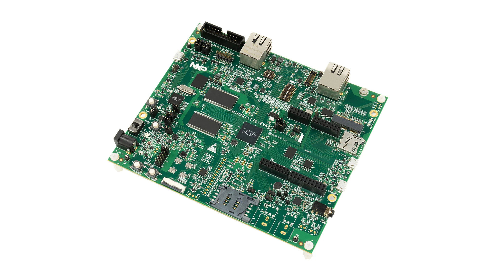
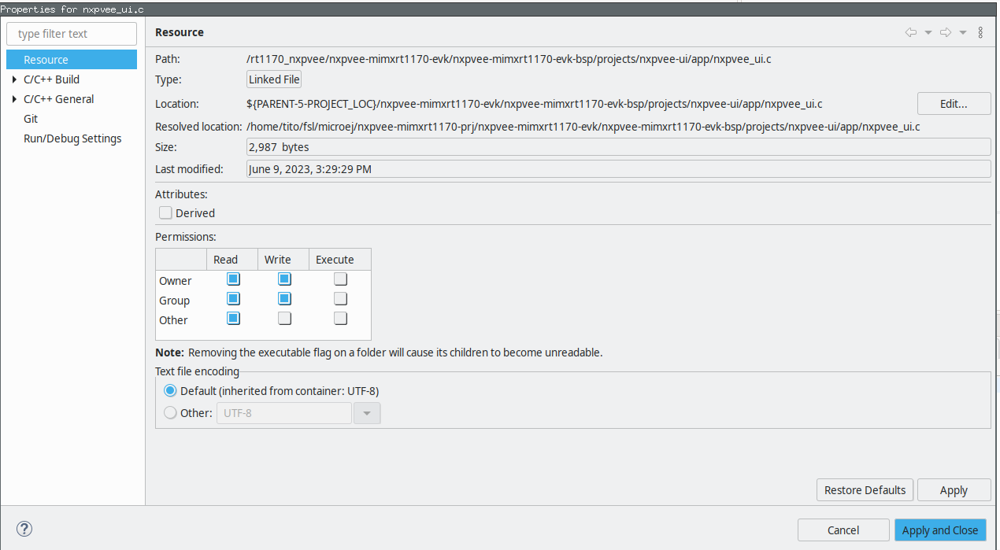

- [NXP VEE for i.MX RT1170 EVK v1.0](#nxp-vee-for-imx-rt1170-evk-v10)
  - [VEE Port Specifications](#vee-port-specifications)
  - [Requirements](#requirements)
  - [Directory structure](#directory-structure)
  - [Preliminary steps](#preliminary-steps)
    - [Get the MicroEJ SDK](#get-the-microej-sdk)
    - [Get MCUXpresso IDE](#get-mcuxpresso-ide)
    - [Get an evaluation license](#get-an-evaluation-license)
  - [Board Setup](#board-setup)
  - [Fetch the source code](#fetch-the-source-code)
    - [West : `PermissionError: \[WinError 5\] Access is denied`](#west--permissionerror-winerror-5-access-is-denied)
  - [MicroEJ IDE project setup](#microej-ide-project-setup)
    - [Import the project in a new workspace](#import-the-project-in-a-new-workspace)
    - [Build the VEE Port](#build-the-vee-port)
  - [Build and run applications using the MicroEJ SDK IDE](#build-and-run-applications-using-the-microej-sdk-ide)
    - [Build and run the applications in simulation mode](#build-and-run-the-applications-in-simulation-mode)
    - [Modify the `AnimatedMascot` application](#modify-the-animatedmascot-application)
  - [Build and run applications on your i.MX RT1170](#build-and-run-applications-on-your-imx-rt1170)
    - [Build the applications for target](#build-the-applications-for-target)
    - [Build the firmware for target hardware using MCUXpresso IDE](#build-the-firmware-for-target-hardware-using-mcuxpresso-ide)
  - [Switching to a production license](#switching-to-a-production-license)
  - [Alternative: build and run from command line](#alternative-build-and-run-from-command-line)
    - [Requirements for building from command line](#requirements-for-building-from-command-line)
    - [Explore available options (works on Linux)](#explore-available-options-works-on-linux)
    - [Populate a Build Kit](#populate-a-build-kit)
    - [Using default evaluation license](#using-default-evaluation-license)
    - [Needed Environment variables](#needed-environment-variables)
    - [compile and flash](#compile-and-flash)
    - [debug](#debug)
    - [Ninja](#ninja)
    - [Compile Release image](#compile-release-image)
    - [Compile using production license](#compile-using-production-license)
  - [Tutorial: Using native C functions from the high level application](#tutorial-using-native-c-functions-from-the-high-level-application)
    - [Declaring and using native functions in the Java world](#declaring-and-using-native-functions-in-the-java-world)
    - [Implementing the native functions in C world](#implementing-the-native-functions-in-c-world)
    - [Implementing a mockup of the native functions for the simulator](#implementing-a-mockup-of-the-native-functions-for-the-simulator)
  - [Get familiar with MICROEJ](#get-familiar-with-microej)
    - [Examples](#examples)
    - [MICROEJ Documentation](#microej-documentation)
  - [Troubleshooting](#troubleshooting)
    - [License Error when building application](#license-error-when-building-application)
# NXP VEE for i.MX RT1170 EVK v1.0
This project is used to build an NXP VEE Port for the [i.MX RT1170 EVK](https://www.nxp.com/design/development-boards/i-mx-evaluation-and-development-boards/i-mx-rt1170-evaluation-kit:MIMXRT1170-EVK) with a display panel [RK055HDMIPI4MA0](https://www.nxp.com/part/RK055HDMIPI4MA0#/).



VEE stands for Virtual Execution Environment and provides a hardware abstraction to develop applications in high-level programming languages such as Java.
NXP VEE is built upon [MicroEJ technology](https://www.microej.com/product/vee/).

This release provides:

* an i.MX RT1170 EVK simulator to develop VEE applications and test them on a host PC
* a front panel showing the EVK and its display in the simulator
* the necessary recipes to embed the VEE architecture for GCC
* various [Foundation Libraries](https://docs.microej.com/en/latest/ApplicationDeveloperGuide/libraries.html) to provide high level libraries to developers
* in particular, Foundation Libraries [MicroUI](https://docs.microej.com/en/latest/ApplicationDeveloperGuide/UI/MicroUI/index.html#section-app-microui) to create user interfaces and [MicroVG](https://docs.microej.com/en/latest/ApplicationDeveloperGuide/UI/MicroVG/index.html) to provide accelerated vector drawing capabilities
* [MCUXpresso SDK](https://mcuxpresso.nxp.com/en/welcome) 2.14.0 for RT1170
* FreeRTOS version 10.4.3
* sample applications demonstrating NXP VEE:
    * SimpleGFX: draw moving NXP coloured boxes using MicroUI
    * AnimatedMascot: draw an animated [Android Vectordrawable](https://developer.android.com/develop/ui/views/graphics/vector-drawable-resources) image using MicroVG
* a [Mock](https://docs.microej.com/en/latest/PlatformDeveloperGuide/mock.html) to give Java implementations for C native functions used by application SimpleGFX


## VEE Port Specifications
The architecture version is 7.20.1
This VEE Port provides the following Foundation Libraries:

|Foundation Library|Version|
|------------------|-------|
|UI-PACK           |13.4.1 |
|VG-PACK           |1.2.1 |
|FS-PACK           |6.0.3 |
|NET-PACK          |11.0.1 |


## Requirements
* PC with Windows 10 or higher, or Linux (tested on Debian 11)
    * Note for Mac users: this documentation does not cover Mac usage, however it is supported by the MicroEJ tools. If you are interested in Mac support, please [contact MicroEJ](https://www.microej.com/contact/#form_2).
* Java JDK 1.11 see [Get the MicroEJ SDK](#get-the-microej-sdk) section
* West, a meta-tool to handle git dependencies
* Internet connection to [MicroEJ Central Repository](https://developer.microej.com/central-repository/)
* i.MX RT1170 EVK board, available [here](https://www.nxp.com/design/development-boards/i-mx-evaluation-and-development-boards/i-mx-rt1170-evaluation-kit:MIMXRT1170-EVK)
* RK055HDMIPI4MA0 display panel, available [here](https://www.nxp.com/part/RK055HDMIPI4MA0#/)
* Optionally: J-Link Debugger to flash the software


## Directory structure
```
├── BuildKit.readme.txt
├── Documentation
├── EULA-EVAL.txt
├── Licenses
├── Makefile
├── Makefile.inc
├── MIMXRT1170-bsp
├── MIMXRT1170-configuration
├── MIMXRT1170-fp
├── MIMXRT1170-Platform-CM7hardfp_GCC48-1.0.0
|   Directory holding the VEE runtime files
├── nxpvee-mimxrt1170-evk-apps
├── nxpvee-mimxrt1170-evk-bsp
├── nxpvee-mimxrt1170-evk-mock
|   Project holding mockup functions
├── nxpvee-mimxrt1170-evk-validation
|   Project holding Java tests to validate the VEE
├── SCR-nxpvee-mimxrt1170-evk.txt
└── west.yml
```


## Preliminary steps

### Get the MicroEJ SDK
The MICROEJ SDK is an Eclipse-based IDE used to build the VEE Port and the high-level applications. In addition, it is able to run a simulator of the target hardware.

The MICROEJ SDK requires Java JDK. JDK version [depends on the MICROEJ SDK version](https://docs.microej.com/en/latest/SDKUserGuide/systemRequirements.html).

* Install the JDK. You can download it on the [Java SE 11](https://www.oracle.com/java/technologies/downloads/#java11) page
* Install MICROEJ SDK 23.07. Please refer to [Download and Install – MicroEJ Documentation](https://docs.microej.com/en/latest/SDKUserGuide/installSDKDistributionLatest.html#) and [Installer Repository](https://repository.microej.com/packages/SDK/23.07/)

This release has been tested with MicroEJ SDK 23.07 and Java JDK 1.11.

### Get MCUXpresso IDE
The MCUXpresso IDE is an Eclipse-based IDE used to build embedded projects for i.MX MCUs.

In this VEE Port release, it is used to build the firmware that will be flashed to target. The MCUXpresso project uses the VEE Port and high level applications built by the MicroEJ SDK.

You can download the MCUXpresso IDE by following the instructions from [here](https://www.nxp.com/design/software/development-software/mcuxpresso-software-and-tools-/mcuxpresso-integrated-development-environment-ide:MCUXpresso-IDE). 

### Get an evaluation license
When you build an embedded application for the first time, the SDK will warn you that a license is needed to build.

A MicroEJ license is required to build high-level applications and the VEE Port for target hardware.

Evaluation licenses can be obtained for free. Please follow [the instructions from MicroEJ](https://docs.microej.com/en/latest/SDKUserGuide/licenses.html#evaluation-license).

With an evaluation license, you can build high-level applications with no limitation in simulation mode. However, applications built with an evaluation license will run for a limited time on target hardware.

Evaluation licenses must be renewed periodically (every month).

**Important note**: applications built with an evaluation license will freeze after a random period of time. A production license is necessary to have a fully working application on the target.


## Board Setup


Setup the i.MX RT1170 EVK
* Check that the dip switches (SW1) are set to OFF, OFF, ON and OFF.
* Connect the micro-USB cable to J11 to power the board.
* You can connect 5 V power supply to J43 if you need to use the display

The USB connection is used as a serial console for the SoC, as a CMSIS-DAP debugger and as a power input for the board.

MicroEJ VEE Port uses the virtual UART from the i.MX RT1170 EVK USB port. A COM port is automatically mounted when the board is plugged into a computer using a USB cable. All board logs are available through this COM port.

The COM port uses the following parameters:

| Baudrate | Data bits bits | Parity bits | Stop bits | Flow control |
| -------- | -------- | -------- | -------- | -------- |
| 115200     | 8     | None     | 1     | None     |

Debugger options

The i.MX RT1170 EVK can either be flashed and connected to a debugger through the USB port J11, or through the JTAG connector J11:
* To use the USB for flashing and debugging, jumpers J6 and J7 should be connected.
* To use the JTAG for flashing and debugging with an external probe, jumper J6 and J7 should be removed.


## Fetch the source code
West must be used to fetch the code and its dependencies.

Please download west from the following location: [West (Zephyr's meta-tool)](https://docs.zephyrproject.org/latest/develop/west/index.html).

On Windows, fetching the source code may trigger the following fatal error:
```error: unable to create file [...]: Filename too long.```
To avoid this, git configuration needs to be updated to handle long file names:

Start Git Bash as Administrator.

Run following command:
```git config --system core.longpaths true```

Clone the repository with the following command:

```
mkdir  nxpvee-mimxrt1170-prj
cd nxpvee-mimxrt1170-prj
west init -m https://github.com/nxp-mcuxpresso/nxp-vee-imxrt1170-evk.git .
west update
```
you will get

```
mcux-sdk  nxpvee-mimxrt1170-evk
```
### West : `PermissionError: [WinError 5] Access is denied`

If you get the error `PermissionError: [WinError 5] Access is denied`, please consider the following procedure :

```
rm .west
cd nxpvee-mimxrt1170-evk
west init -l
cd ..
west update
```

## MicroEJ IDE project setup
### Import the project in a new workspace
Launch MicroEJ SDK and create a blank workspace.

Import the cloned repository as an existing project:


Then select all projects from the repository, **except project `rt1170_nxpvee` if it's in the list**.

Project `rt1170_nxpvee` is the MCUXpresso project and is not part of the MicroEJ SDK projects.


The package explorer view should look like this:


### Build the VEE Port
The VEE Port for the board is the first thing to build with the IDE.
For demonstration purposes, one of the release examples uses a mockup (more details follow in the native functions description). 
The mockup is a dependency of the VEE Port and must therefore be built beforehand.


#### Build the mockup
Right click on the mockup project and select `Build Module`:


#### <a name="build-the-vee-port"></a> Build the VEE Port
Once the mockup dependency is resolved, the VEE Port can be built by using [VEE Port Build](https://docs.microej.com/en/latest/VEEPortingGuide/platformCreation.html#platform-build) instructions.
Right-click on the configuration project and select `Build Module`:


Building the platform will populate the initally empty `MIMXRT1170-Platform-CM7hardfp_GCC48-1.0.0` project which will be used to build VEE applications.
Under the `source` folder of the VEE Port, you will find the following files: 
* The C header files of the native needed by the VEE Port libraries are located in the `include` folder.
* The Java API of the VEE Port libraries is located in the `javaAPIS` folder.
* The jar files of the VEE Port libraries are located in the `javaLibs` folder.
* The Simulation files are located in the `S3` and `mocks` folders. 
* The VEE core, the MicroJVM, and some tools.

## Build and run applications using the MicroEJ SDK IDE
Two example VEE applications are provided with this release.

Application `SimpleGFX` displays three moving rectangles using the [MicroUI API](https://docs.microej.com/en/latest/ApplicationDeveloperGuide/UI/MicroUI/index.html#section-app-microui). The coordinates of the rectangles are calculated in C native functions.

Application `AnimatedMascot` draws an animated [Android Vectordrawable](https://developer.android.com/develop/ui/views/graphics/vector-drawable-resources) image. It uses the i.MX RT1170's GCNanoLite-V as an accelerator.

### Build and run the applications in simulation mode
To run applications in simulation mode, right-click on the apps project and select `Run As -> MicroEJ Application`:


The IDE will prompt which application should be built: either `SimpleGFX` or `AnimatedMascot`:


Choose the application. Then run the application in simulation mode by choosing the mode _(SIM)_:


Here is the `AnimatedMascot` application running in simulation:


### Modify the `AnimatedMascot` application
Now we will show you how easy it is to modify and test your Java application on the Simulator. 

To do so, we will modify the background color of the `AnimatedMascot` application:

* Open the `AnimatedMascot.java` file located in the `nxpvee-mimxrt1170-evk-apps/src/main/java/com/nxp/animatedMascot` folder. 
*  It sets the background color line 57. Replace the following line: 
```
g.setColor(Colors.BLACK);
```
by 
```
g.setColor(Colors.GREEN);
```
* Follow [Run the applications in simulation mode](#build-and-run-the-applications-in-simulation-mode) instructions to launch the modified application on the Simulator.

Here is the modified `AnimatedMascot` application running in simulation:


## Build and run applications on your i.MX RT1170

### Build the applications for target
With the MicroEJ SDK IDE, simply run the application the same way than [in simulation](#build-and-run-the-applications-in-simulation-mode) but by choosing the mode _(EMB)_.

#### Output of the build
The build will produce two artifacts:

* *microejapp.o*: the linked managed code application.
* *microejruntime.a*: the VEE core.

These artifacts are copied to the BSP project in the directory `projects/microej/platform/lib`.

### Build the firmware for target hardware using MCUXpresso IDE
Once the application is ready, the firmware can be built using a C toolchain for Cortex-M.

Launch the MCUXpresso IDE and click on `Import Projects...`


and then on `Existing Project into workspace`


navigate to the path

nxpvee-mimxrt1170-evk/nxpvee-mimxrt1170-evk-bsp/projects/nxpvee-ui/mcuide

click `Finish`

From here you can compile and debug the project as any other MCUXpresso project.
You can connect MCUXpresso to the board using the USB or using a SEGGER J-Link probe.

For instance, to build the firmware and debug it on target board, use the `Debug your project` section:


Please note that all header and source files are Eclipse links to the real files inside the project. Should you want to add more please file, follow the same convention as shown here:




After building the firmware, the build artifacts will be available in nxpvee-mimxrt1170-evk/nxpvee-mimxrt1170-evk-bsp/projects/nxpvee-ui/mcuide/Debug:
```
rt1170_nxpvee.axf (ELF file with symbols)
```


## Switching to a production license
To switch to a production license, please contact your NXP representative.

## Alternative: build and run from command line
A set of makefiles is provided to build either the whole project (VEE Port, high level application, firmware) or the final firmware from command line instead of using the MicroEJ / MCUXpresso IDE.
This can be useful for continuous integration or to get a more automated environment during development.

To access the top level makefile:
```
cd nxpvee-mimxrt1170-evk
```

### Requirements for building from command line

#### C toolchain
To build an image that runs on target, you need a Cortex-M toolchain.
The toolchain used to validate this release is the [GNU ARM Embedded Toolchain](https://developer.arm.com/downloads/-/gnu-rm).

**Toolchain for Linux**: [gcc-arm-none-eabi-10.3-2021.10-x86_64-linux.tar.bz2](https://developer.arm.com/-/media/Files/downloads/gnu-rm/10.3-2021.10/gcc-arm-none-eabi-10.3-2021.10-x86_64-linux.tar.bz2?rev=78196d3461ba4c9089a67b5f33edf82a&hash=D484B37FF37D6FC3597EBE2877FB666A41D5253B)

**Toolchain for Windows**: [gcc-arm-none-eabi-10.3-2021.10-win32.exe](https://developer.arm.com/-/media/Files/downloads/gnu-rm/10.3-2021.10/gcc-arm-none-eabi-10.3-2021.10-win32.exe?rev=29bb46cfa0434fbda93abb33c1d480e6&hash=3C58D05EA5D32EF127B9E4D13B3244D26188713C)

Once installed, the following environment variable must be set to point to the toolchain directory:

Linux:
```
export ARMGCC_DIR=/opt/gcc-arm-none-eabi-10.3-2021.10/
```

Windows:
```
set ARMGCC_DIR="/path/to/your/ARMGCC/directory/"
```
or directly in your Windows environment variables, to prevent doing it everytime you open a new commmand prompt.

#### CMake
The build system used to generate the firmware is based on CMake.

Linux: to install CMake on a Debian based distro, run:
```
sudo apt install cmake
```

Windows: CMake can be installed from [this page](https://cmake.org/download/).

#### Make
Linux: to install GNU Make on a Debian based distro, run:
```
sudo apt install make
```

Windows: GNU Make can be installed from [here](https://gnuwin32.sourceforge.net/packages/make.htm#:~:text=Complete%20package%2C%20except%20sources).

#### SED
Windows: sed is necessary in order to debug with gdb
Please visit this page for instruction on how to install it
[sed](https://gnuwin32.sourceforge.net/packages/sed.htm)

### Explore available options (works on Linux)
```
make <TAB>

# will get you
clean                        # clean all projects
nxpvee-ui-clean              # clean UI project
nxpvee-ui-gdb                # debug UI project using gdb and jlink
nxpvee-ui-java_run           # run simulation, you can override java main using MAIN=com.nxp.animatedMascot.AnimatedMascot make nxpvee-ui-java_run
nxpvee-ui-flash              # flash board using jlink
nxpvee-ui-gdb_cmsisdap       # debug UI project using gdb and CMSIS
nxpvee-ui.prj                # build complete UI project
nxpvee-ui-flash_cmsisdap     # flash board using CMSIS
nxpvee-ui-java_rebuild       # rebuild java app
nxpvee-validation.prj        # compile and run validation
```

### Populate a Build Kit
It is necessary to export a Build Kit from the MicroEJ SDK IDE. This Build Kit is used by the makefile to build the VEE Port and the high level applications.

The Build Kit is bundled with the SDK and can be exported using the following steps:
```
    Select File > Export > MicroEJ > Module Manager Build Kit,
    Choose an empty Target directory, `i.e. ${HOME}/microej/BuildKit `
    Click on the Finish button.
```
### Using default evaluation license
Please follow  [Install the License Key](https://docs.microej.com/en/latest/SDKUserGuide/licenses.html#install-the-license-key) to be able to use make with an evaluation key

### Needed Environment variables
In order to compile correctly you will need to export

```
export MICROEJ_BUILDKIT_PATH_VAR=${HOME}/microej/BuildKit
export ECLIPSE_HOME_VAR=${HOME}/MicroEJ/MicroEJ-SDK-21.11/rcp/
```

you can also specify a partial repository, when needed (for example if you need libraries that are not yet public)
```
export MODULE_REPOSITORY_SETTINGS_FILE_VAR=${HOME}/microej/microej-partial-repository/ivysettings.xml
```
### compile and flash
```
nxpvee-ui.prj

# flash with a J-Link probe
nxpvee-ui-flash

# or flash with USB using CMSIS-DAP
nxpvee-ui-flash_cmsisdap
```

### debug
```
nxpvee-ui-gdb
# or
nxpvee-ui-gdb_cmsisdap
```

### Ninja
to speed up compilation you can use ninja instead of make
```
MAKE=ninja make nxpvee-ui.prj
```

### Compile Release image
to compile release image you can
```
make nxpvee-ui.prj RELEASE=1
```

### Compile using production license
to compile using a production license, a dongle is needed
```
make nxpvee-ui.prj USAGE=prod
```


## Tutorial: Using native C functions from the high level application
Some functions directly used by the high-level application can be implemented in C. It is called the [Native Interface Mechanism](https://docs.microej.com/en/latest/VEEPortingGuide/native.html).

A native method is declared in the Application but is implemented in the native world. So a native declaration requires a C and Java implementation for the Simulator. You can find an example of a native method on [this page](https://docs.microej.com/en/latest/VEEPortingGuide/sni.html?highlight=native#example).

You can have custom natives specific to the Java application (less portable between VEE Ports but fast execution). On the other hand, you can use native methods provided by [Foundation Libraries](https://docs.microej.com/en/latest/glossary.html#term-Foundation-Library) (Portable between VEE Ports but takes more time at the execution). 

The SimpleGFX application uses of C native function to calculate rectangles' coordinates (mainly for demonstration's sake).

### Declaring and using native functions in the Java world
It is recommended to store all your native methods in the same public class. This public class contains methods with the same parameters as the C native functions.

The name of the C function is `Java_<package_name>_<class_name>_<method_name>`. Any underscore (`_`) character in `package_name`, `class_name`, or `function_name` is replaced by `_1`. Dots (`.`) are replaced by underscores `_`.

For these reasons, it is handy to stick to Java naming conventions and use camel case for class and method names and lowercase only package names.

For example:
````
package com.nxp.application;

public class MyClassNatives {
	/* package */ native static int NativeFunction(int a);
};
````

This can be used in the application source code this way:
````
j = MyClassNatives.NativeFunction(i);
````

### Implementing the native functions in C world
The native functions are implemented in C, with a name deriving from the package name and the native class name.
In the previous example, we would have:
````
int Java_com_nxp_application_MyClassNatives_NativeFunction(int a)
{
    int i;

[...]

    return i;
}
````

When you implement a native method, it is recommended to use the type of `sni.h` rather than the native type. This ensures type consistency between Java and C. 
You could use `jint` instead of `int` in the example above.

The `sni.h` file is located on `nxpvee-mimxrt1170-evk-bsp/project/microej/platform/inc` folder.

### Implementing a mockup of the native functions for the simulator
Mockup functions are used to simulate the behavior of native functions when using the MicroEJ SDK Simulator. Mockups are detailed in the [MicroEJ website](https://docs.microej.com/en/latest/PlatformDeveloperGuide/mock.html).

They are implementated in a different MicroEJ SDK project (`nxpvee-mimxrt1170-evk-mock`).

The name of the file containing the mockup functions is supposed to be the same as the one where the native functions are declared in the application project (e.g. `SimpleGFXNatives.java`).

The file may look like this:
````
package com.nxp.application;

public class MyClassNatives {
    static int NativeFunction(int a) {
        int i;

        [...]

        return i;
    }
};
````

Please note that this project mockup must be added as a dependency inside the VEE Port's `module.ivy` file. The `module.ivy` file is located in the `MIMXRT1170-configuration` folder. You will find inside all the dependencies used by the VEE Port.  


The `org` and `name` fields can be found inside the mockup's `module.ivy` file (respectively `organisation` and `module`):


After any modification to the mockup project, you need to rebuild the mock (right click on the mock project and select `Build Module`) and the platform (see [Build the platform](#build-the-vee-port)).

## Get familiar with MICROEJ

To discover insights about MicroEJ technology, please follow some of the entry points below. In addition, you will find useful links to our documentation and our GitHub. 

### Examples

You can try to run other examples on our VEE Port. Here is an exhaustive list of them so that you can go further in the MicroEJ technology:

* [Understand How to Build a Firmware](https://docs.microej.com/en/latest/Tutorials/tutorialUnderstandMicroEJFirmwareBuild.html): It is a document that describes the components, their dependencies, and the process involved in the build of a Firmware.
* [Get Started With GUI](https://docs.microej.com/en/latest/Tutorials/getStartedWithGUI/index.html): It is a guided tutorial to get the basics concepts of our UI.
* [Github resources](https://github.com/MicroEJ):
    * How to use [foundation libraries](https://github.com/MicroEJ/Example-Standalone-Foundation-Libraries) on the Virtual Device or on board.
    * Various examples of [how-to's](https://github.com/MicroEJ/How-To).
    * Some [Demo projects](https://github.com/orgs/MicroEJ/repositories?q=demo&type=all&language=&sort=).


### MICROEJ Documentation

You can take a look at the MICROEJ development documentation. 
Below you can find some important chapters:
* [Application Developer Guide](https://docs.microej.com/en/latest/ApplicationDeveloperGuide/index.html): It covers concepts essential to MicroEJ Applications design.
* [MICROEJ VEE Port Developer Guide](https://docs.microej.com/en/latest/VEEPortingGuide/index.html): It covers the main process and configuration of a MicroEJ VEE.
* [Tutorials](https://docs.microej.com/en/latest/Tutorials/index.html#): There are multiple tutorials to master different subjects about the MicroEJ environment (including UI development, code quality and debug, CI/CD…).

## Troubleshooting

### License Error when building application

#### [M65] - License check failed

If you have the following error `[M65] - License check failed [tampered (3)]`, please follow the steps on this [page](https://forum.microej.com/t/license-check-fail-workaround-on-microej-sdk-with-jdk-version-8u351/1182)

