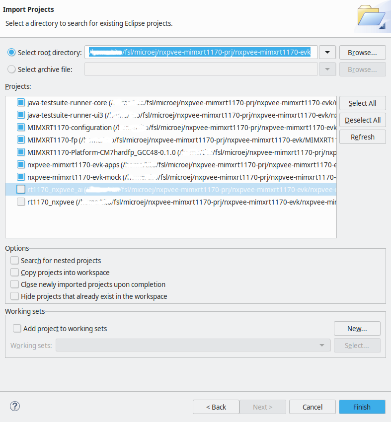
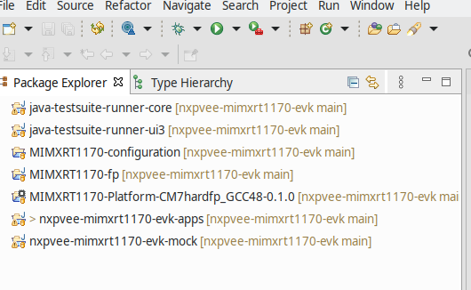
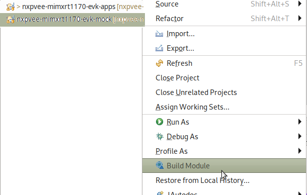
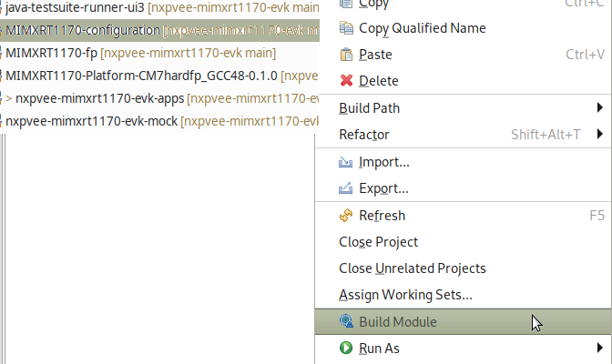
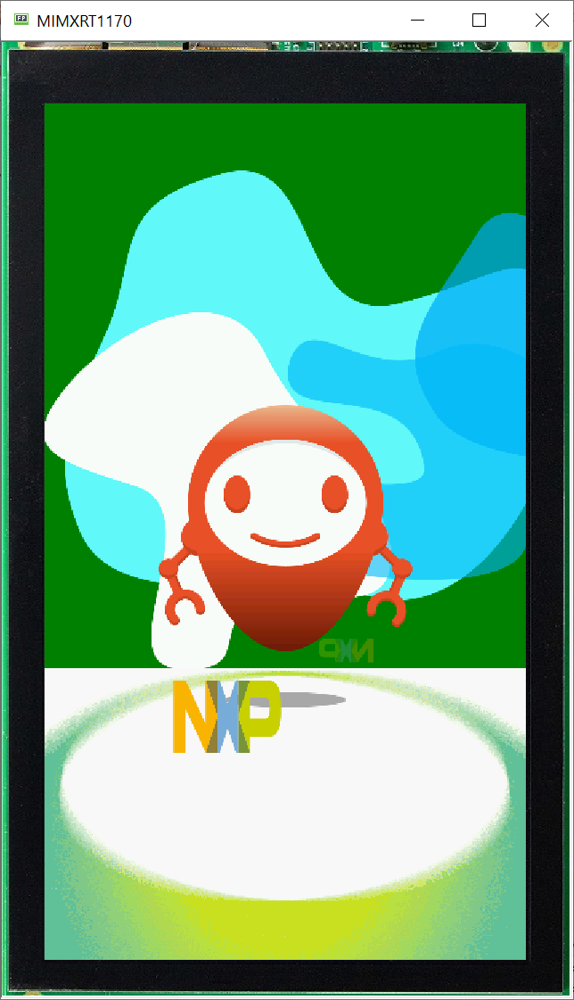

- [NXP Platform Accelerator for i.MX RT1170 Evaluation Kit v2.2.0](#nxp-platform-accelerator-for-imx-rt1170-evaluation-kit-v220)
  - [MicroEJ SDK 6](#microej-sdk-6)
  - [MicroEJ SDK 5](#microej-sdk-5)
  - [VEE Port Specifications](#vee-port-specifications)
  - [Requirements](#requirements)
  - [Directory structure](#directory-structure)
  - [Preliminary steps](#preliminary-steps)
    - [Get the MicroEJ SDK](#get-the-microej-sdk)
    - [Get Visual Studio Code and MCUXpresso Installer tool](#get-visual-studio-code-and-mcuxpresso-installer-tool)
    - [MCUXpresso Installer tool](#mcuxpresso-installer-tool)
  - [Fetch the source code](#fetch-the-source-code)
  - [MicroEJ IDE project setup](#microej-ide-project-setup)
    - [Import the project in a new workspace](#import-the-project-in-a-new-workspace)
    - [Build the VEE Port](#build-the-vee-port)
      - [Build the mockup](#build-the-mockup)
      - [<a name="build-the-vee-port"></a> Build the VEE Port](#-build-the-vee-port)
  - [Build and run applications using the MicroEJ SDK IDE](#build-and-run-applications-using-the-microej-sdk-ide)
    - [Build and run the applications in simulation mode](#build-and-run-the-applications-in-simulation-mode)
    - [Modify the `AnimatedMascot` application](#modify-the-animatedmascot-application)
  - [Build and run applications on your i.MX RT1170 Evaluation Kit](#build-and-run-applications-on-your-imx-rt1170-evaluation-kit)
    - [Board Setup](#board-setup)
      - [MIMXRT1170-EVKB](#mimxrt1170-evkb)
      - [MIMXRT1170-EVK](#mimxrt1170-evk)
    - [Get an evaluation license](#get-an-evaluation-license)
    - [Build the applications for target](#build-the-applications-for-target)
      - [Output of the build](#output-of-the-build)
    - [Build the firmware for target hardware using VS Code](#build-the-firmware-for-target-hardware-using-vs-code)
      - [Load the project into VS Code](#load-the-project-into-vs-code)
      - [Select a Preset](#select-a-preset)
      - [Configure the project](#configure-the-project)
      - [Configure the bsp features](#configure-the-bsp-features)
        - [Compile AI Demo](#compile-ai-demo)
      - [Build the project](#build-the-project)
  - [Switching to a production license](#switching-to-a-production-license)
  - [Multi-Sandbox](#multi-sandbox)
  - [Alternative: build and run from command line](#alternative-build-and-run-from-command-line)
    - [Requirements for building from command line](#requirements-for-building-from-command-line)
      - [C toolchain](#c-toolchain)
      - [CMake](#cmake)
      - [Make](#make)
    - [Populate a Build Kit](#populate-a-build-kit)
    - [Using default evaluation license](#using-default-evaluation-license)
    - [Needed Environment variables](#needed-environment-variables)
    - [Explore available options (works on Linux)](#explore-available-options-works-on-linux)
    - [Compile and flash](#compile-and-flash)
    - [Compilation defaults](#compilation-defaults)
    - [Compile AI demo](#compile-ai-demo-1)
    - [Debug](#debug)
    - [Compile Release image](#compile-release-image)
    - [Compile using production license](#compile-using-production-license)
  - [System View](#system-view)
  - [Tutorial: Using native C functions from the high level application](#tutorial-using-native-c-functions-from-the-high-level-application)
    - [Declaring and using native functions in the Java world](#declaring-and-using-native-functions-in-the-java-world)
    - [Implementing the native functions in C world](#implementing-the-native-functions-in-c-world)
    - [Implementing a mockup of the native functions for the simulator](#implementing-a-mockup-of-the-native-functions-for-the-simulator)
  - [Get familiar with MicroEJ](#get-familiar-with-microej)
    - [Examples](#examples)
    - [MicroEJ Documentation](#microej-documentation)
  - [Troubleshooting](#troubleshooting)
    - [Setup error](#setup-error)
      - [West update and "Filename too long" issue](#west-update-and-filename-too-long-issue)
      - [West update and "PermissionError: \[WinError 5\] Access is denied" issue](#west-update-and-permissionerror-winerror-5-access-is-denied-issue)
    - [License Error when building application](#license-error-when-building-application)
      - [\[M65\] - License check failed](#m65---license-check-failed)
  - [Known issues](#known-issues)
    - [RSA key size limited to 2048 bits](#rsa-key-size-limited-to-2048-bits)

# NXP Platform Accelerator for i.MX RT1170 Evaluation Kit v2.2.0
This project is used to build NXP Platform Accelerator for the [i.MX RT1170 Evaluation Kit](https://www.nxp.com/design/design-center/development-boards-and-designs/i-mx-evaluation-and-development-boards/i-mx-rt1170-evaluation-kit:MIMXRT1170-EVKB) with a display panel [RK055HDMIPI4MA0](https://www.nxp.com/part/RK055HDMIPI4MA0#/).


NXP Platform Accelerator a VEE (Virtual Execution Environment) and provides a hardware abstraction to develop applications in high-level programming languages such as Java.

NXP Platform Accelerator is built upon [MicroEJ technology](https://www.microej.com/product/vee/).

This release includes:

* i.MX RT1170 Evaluation Kit simulator to develop VEE applications and test them on a host PC
    * The simulator program has a graphic display of the EVK board and its LCD panel
* The necessary recipes to embed the VEE architecture for GCC
* Various [Foundation Libraries](https://docs.microej.com/en/latest/ApplicationDeveloperGuide/libraries.html) to provide high level libraries to developers. Notable Foundation Libraries part of this release are:
    * [MicroUI](https://docs.microej.com/en/latest/ApplicationDeveloperGuide/UI/MicroUI/index.html#section-app-microui) to create user interfaces

    * [MicroVG](https://docs.microej.com/en/latest/ApplicationDeveloperGuide/UI/MicroVG/index.html) to provide accelerated vector drawing capabilities


    * [Networking](https://docs.microej.com/en/latest/ApplicationDeveloperGuide/networkingFoundationLibraries.html)


    * [AI](https://forge.microej.com/ui/native/microej-developer-repository-release/com/nxp/api/ai/1.0.0/): AI / Machine Learning library based on TensorFlowLite


* [MCUXpresso SDK](https://mcuxpresso.nxp.com/en/welcome) 2.15.100 for i.MX RT1170 Evaluation Kit
* [FreeRTOS](https://www.freertos.org/index.html) version 10.5.1
* Sample applications demonstrating NXP VEE:

    * SimpleGFX: draw moving NXP coloured boxes using MicroUI


    * AnimatedMascot: draw an animated [Android Vectordrawable](https://developer.android.com/develop/ui/views/graphics/vector-drawable-resources) image using MicroVG


    * AI_Cifarnet_Demo: runs an inference of CifarNet quantized TensorFlow model on sample images 

* [Mock](https://docs.microej.com/en/latest/PlatformDeveloperGuide/mock.html) support with Java stub implementations to mimick C native functions. Thanks to this mock support, the SimpleGFX application can smoothly run on the simulator

## MicroEJ SDK 6

NXP Platform Accelerator is built on MicroEJ technology.

MicroEJ SDK 6 is the latest available MicroEJ SDK.
The SDK 6 uses Gradle plugin to compile and package MicroEJ modules.
It allows the user to use his favourite IDE such as Android Studio or IntelliJ IDEA (see [the list of supported IDE](https://docs.microej.com/en/latest/SDK6UserGuide/install.html#install-the-ide)).

SDK 6 is currently limited to the build, test and simulation of **Applications and Add-on Libraries** (see [Scope and Limitations](https://docs.microej.com/en/latest/SDK6UserGuide/limitations.html#sdk-6-limitations) for more information).
If you need other features, such as **developping a VEE Port**, you have to use the SDK 5.

If you are an application developer only and do not need to make changes to the VEE Port, you can use the SDK 6. Please click on the button below to access to the SDK 6 Getting Started on the i.MX RT1170 Evaluation Kit.

[](https://docs.microej.com/en/latest/SDK6UserGuide/gettingStartedIMXRT1170.html)

## MicroEJ SDK 5

If you want to modify the VEE Port, make changes to low level source code, please use SDK 5 and continue following this README.


## VEE Port Specifications
The architecture version is ```8.1.1```.


This VEE Port provides the following Foundation Libraries:

|Foundation Library|Version|
|------------------|-------|
|BON      |1.4|
|DEVICE   |1.2|
|DRAWING  |1.0|
|EDC      |1.3|
|FS       |2.1|
|KF       |1.7|
|MICROUI  |3.5|
|MICROVG  |1.4|
|NET      |1.1|
|SECURITY |1.4|
|SNI      |1.4.0|
|SSL      |2.2|
|TRACE    |1.1|


The VEE Port is derived into:
* a Mono-Sandbox VEE Port (default)

* a Multi-Sandbox VEE Port


## Requirements
* PC with Windows 10 or higher, or Linux (tested on Debian 11)
    * Note for Mac users: this documentation does not cover Mac usage, however it is supported by the MicroEJ tools. If you are interested in Mac support, please [contact MicroEJ](https://www.microej.com/contact/#form_2).
* Internet connection to [MicroEJ Central Repository](https://developer.microej.com/central-repository/)
* MicroEJ SDK Distribution 23.07 or higher, available [here](https://developer.microej.com/microej-sdk-software-development-kit/)

* i.MX RT1170 Evaluation Kit board (can be ordered [here](https://www.nxp.com/design/design-center/development-boards-and-designs/i-mx-evaluation-and-development-boards/i-mx-rt1170-evaluation-kit:MIMXRT1170-EVKB)) and RK055HDMIPI4MA0 display panel (can be ordered [here](https://www.nxp.com/part/RK055HDMIPI4MA0#/))

* Optionally: J-Link Debugger to flash the software


## Directory structure
```
├── bsp
│   └── projects
│       ├── common
│       ├── microej
│       └── nxpvee-ui
├── BuildKit.readme.txt
├── CHANGELOG.md
├── Documentation
├── Licenses
├── LICENSE.txt
├── Makefile
├── Makefile.inc
├── microej
│   ├── apps
│   ├── front-panel
│   ├── imageGenerator
│   ├── MIMXRT1170-evk_platform-CM7hardfp_GCC48-2.2.0
│   ├── mock
│   ├── validation
│   └── vee-port-configuration
├── README.md
├── SCR-nxpvee-mimxrt1170-evk.txt
├── .vscode
└── west.yml
```


## Preliminary steps

### Get the MicroEJ SDK
The MicroEJ SDK is an Eclipse-based IDE used to build the VEE Port and the high-level applications. The SDK can be used to run the i.MX RT1170 Evaluation Kit simulator.

The MicroEJ SDK requires Java JDK. JDK version [depends on the MicroEJ SDK version](https://docs.microej.com/en/latest/SDKUserGuide/systemRequirements.html).

* Install the JDK. You can download it on the [Java SE 11](https://www.oracle.com/java/technologies/downloads/#java11) page
* Install MicroEJ SDK 23.07. Please refer to [Download and Install – MicroEJ Documentation](https://docs.microej.com/en/latest/SDKUserGuide/installSDKDistributionLatest.html#) and [Installer Repository](https://repository.microej.com/packages/SDK/23.07/)

This release has been tested with MicroEJ SDK 23.07 and Java JDK 11.


### Get Visual Studio Code and MCUXpresso Installer tool
VS Code is an IDE used to build, flash and debug embedded projects.

In this VEE Port release, VS Code is used to build the firmware that will be flashed to target. VS Code project uses the VEE Port and high level applications built by the MicroEJ SDK.

* You can download VS Code IDE [here](https://code.visualstudio.com/download).
* Start VS Code and install the [MCUXpresso for VS Code](https://www.nxp.com/design/software/development-software/mcuxpresso-software-and-tools-/mcuxpresso-for-visual-studio-code:MCUXPRESSO-VSC?tid=vanMCUXPRESSO-VSC) extension package.
* Install the [MCUXpresso VS Code package dependencies](https://github.com/nxp-mcuxpresso/vscode-for-mcux/wiki/Dependency-Installation) to support the full development flow.

### MCUXpresso Installer tool

Using previously installed MCUXpresso Installer tool, need to install following tools that are used during compilation/debug:

* CMake, Ninja, West and ARM GNU Toolchain under MCUXpresso SDK Developer
* LinkServer under its own section
* SEGGER J-Link under its own section (if optional J-Link is used)

These tools can also be installed independently, MCUXpresso installer tool is just providing a convenient way to install them.
In case of standalone installation, following versions need to be installed:

* CMake version 3.27 minimum
* ARM GNU Toolchain version 13.2.1 minimum
* LinkServer version 1.6.133 minimum


## Fetch the source code

Clone the repository with the following command:

```
mkdir nxpvee-mimxrt1170-prj
cd nxpvee-mimxrt1170-prj
west init -m https://github.com/nxp-mcuxpresso/nxp-vee-imxrt1170-evk .
west update
```
you will get


```
.west nxpvee-mimxrt1170-evk
```


## MicroEJ IDE project setup
### Import the project in a new workspace
Launch MicroEJ SDK and create a blank workspace.

Import the cloned repository as an existing project:


Then select all projects from the repository.



The package explorer view should look like this:



### Build the VEE Port
The VEE Port for the board is the first thing to build with the IDE.
For demonstration purposes, one of the release examples uses a mockup (more details follow in the native functions description). 
The mockup is a dependency of the VEE Port and must therefore be built beforehand.


#### Build the mockup
Right click on the mockup project and select `Build Module`:



#### <a name="build-the-vee-port"></a> Build the VEE Port
Once the mockup dependency is resolved, the VEE Port can be built by using [VEE Port Build](https://docs.microej.com/en/latest/VEEPortingGuide/platformCreation.html#platform-build) instructions.
Right-click on the configuration project and select `Build Module`:



Building the platform will populate the initally empty `MIMXRT1170-evk_platform-CM7hardfp_GCC48-2.2.0` project which will be used to build VEE applications.
Under the `source` folder of the VEE Port, you will find the following files: 
* The C header files of the native needed by the VEE Port libraries are located in the `include` folder.
* The Java API of the VEE Port libraries is located in the `javaAPIS` folder.
* The jar files of the VEE Port libraries are located in the `javaLibs` folder.
* The Simulation files are located in the `S3` and `mocks` folders. 
* The VEE core, the MicroJVM, and some tools.

## Build and run applications using the MicroEJ SDK IDE

Two example VEE applications are provided with this release.


Application `SimpleGFX` displays three moving rectangles using the [MicroUI API](https://docs.microej.com/en/latest/ApplicationDeveloperGuide/UI/MicroUI/index.html#section-app-microui). The coordinates of the rectangles are calculated in C native functions.


Application `AnimatedMascot` draws an animated [Android Vectordrawable](https://developer.android.com/develop/ui/views/graphics/vector-drawable-resources) image. It uses the RT1170's GCNanoLite-V as an accelerator.


### Build and run the applications in simulation mode
To run applications in simulation mode, right-click on the apps project and select `Run As -> MicroEJ Application`:


The IDE will prompt which application should be built: either `SimpleGFX` or `AnimatedMascot`:


Choose the application. Then run the application in simulation mode by choosing the mode _(SIM)_:


Here is the `AnimatedMascot` application running in simulation:


### Modify the `AnimatedMascot` application
Now we will show you how easy it is to modify and test your Java application on the Simulator. 

To do so, we will modify the background color of the `AnimatedMascot` application:

* Open the `AnimatedMascot.java` file located in the `microej/apps/src/main/java/com/nxp/animatedMascot` folder. 
*  It sets the background color line 85. Replace the following line: 
```
g.setColor(Colors.WHITE);
```
by 
```
g.setColor(Colors.GREEN);
```
* Follow [Run the applications in simulation mode](#build-and-run-the-applications-in-simulation-mode) instructions to launch the modified application on the Simulator.

Here is the modified `AnimatedMascot` application running in simulation:




## Build and run applications on your i.MX RT1170 Evaluation Kit


### Board Setup

There is 2 revisions of the i.MX RT1170 EVK: MIMXRT1170-EVKB and MIMXRT1170-EVK. Set the revision of the board you are using in the bsp:

* Open [flags.cmake](bsp/projects/nxpvee-ui/armgcc/flags.cmake) file located in `nxpvee-mimxrt1170-evk/nxpvee-mimxrt1170-evk-bsp/projects/nxpvee-ui/armgcc` folder.
* Comment or uncomment the line `SET(MIMXRT1170_EVKB 1)`.

Depending of the revision of your evaluation kit, follow the corresponding hardware setup: 

* [MIMXRT1170-EVKB](#mimxrt1170-evkb)
* [MIMXRT1170-EVK](#mimxrt1170-evk)

#### MIMXRT1170-EVKB


Setup the i.MX RT1170 EVKB
* Check that the dip switches (SW1) are set to OFF, OFF, ON and OFF.
* Connect the micro-USB cable to J86 to power the board.
* You can connect 5 V power supply to J43 if you need to use the display

The USB connection is used as a serial console for the SoC, as a CMSIS-DAP debugger and as a power input for the board.

MicroEJ VEE Port uses the virtual UART from the i.MX RT1170 EVKB USB port. A COM port is automatically mounted when the board is plugged into a computer using a USB cable. All board logs are available through this COM port.

The COM port uses the following parameters:

| Baudrate | Data bits bits | Parity bits | Stop bits | Flow control |
| -------- | -------- | -------- | -------- | -------- |
| 115200     | 8     | None     | 1     | None     |

Debugger options

The i.MX RT1170 EVKB can either be flashed and connected to a debugger through the USB port J11, or through the JTAG connector J1:
* To use the USB for flashing and debugging, jumper JP5 should be removed.
* To use the JTAG for flashing and debugging with an external probe, jumper JP5 should be connected.


Once your setup is done, you can continue this Readme at [Get an evaluation license](#get-an-evaluation-license) section.

#### MIMXRT1170-EVK


Setup the i.MX RT1170 EVK
* Check that the dip switches (SW1) are set to OFF, OFF, ON and OFF.
* Connect the micro-USB cable to J11 to power the board.
* You can connect 5 V power supply to J43 if you need to use the display

The USB connection is used as a serial console for the SoC, as a CMSIS-DAP debugger and as a power input for the board.

MicroEJ VEE Port uses the virtual UART from the i.MX RT1170 EVK USB port. A COM port is automatically mounted when the board is plugged into a computer using a USB cable. All board logs are available through this COM port.

The COM port uses the following parameters:

| Baudrate | Data bits bits | Parity bits | Stop bits | Flow control |
| -------- | -------- | -------- | -------- | -------- |
| 115200     | 8     | None     | 1     | None     |

Debugger options

The i.MX RT1170 EVK can either be flashed and connected to a debugger through the USB port J11, or through the JTAG connector J1:
* To use the USB for flashing and debugging, jumpers J6 and J7 should be connected.
* To use the JTAG for flashing and debugging with an external probe, jumper J6 and J7 should be removed.


Once your setup is done, you can continue this Readme at [Get an evaluation license](#get-an-evaluation-license) section.


### Get an evaluation license
A license is required to build an embedded application. 

A MicroEJ license is required to build high-level applications and the VEE Port for target hardware.

Evaluation licenses can be obtained for free. Please follow [the instructions from MicroEJ](https://docs.microej.com/en/latest/SDKUserGuide/licenses.html#evaluation-license).

With an evaluation license, you can build high-level applications with no limitation in simulation mode. However, applications built with an evaluation license will run for a limited time on target hardware.

Evaluation licenses must be renewed periodically (every month).

**Important note**: applications built with an evaluation license will freeze after a random period of time. A production license is necessary to have a fully working application on the target.


### Build the applications for target
With the MicroEJ SDK IDE, simply run the application the same way than [in simulation](#build-and-run-the-applications-in-simulation-mode) but by choosing the mode _(EMB)_.

#### Output of the build
The build will produce two artifacts:

* *microejapp.o*: the linked managed code application.
* *microejruntime.a*: the VEE core.

These artifacts are copied to the BSP project in the directory `projects/microej/platform/lib`.

### Build the firmware for target hardware using VS Code


#### Load the project into VS Code
Launch VS Code IDE and click on `File -> Add Folder to Workspace...`


Navigate to the nxpvee-mimxrt1170-evk path then click `Add`.

From here you can compile and debug the project as any other C project.

To do so you need to configure then build the CMake project by following the steps below:

#### Select a Preset
Open the Command Palette (`CTRL + SHIFT + p`) and run `CMake: Select Configure Preset` to select the build mode you wish to use.

By default, you can select `flexspi_nor_sdram_debug_evkb` variant.


This can also be done by using Projects section from MCUXpresso for VS code" view, and choose appropriate build as default.


#### Configure the project
Open the Command Palette (`CTRL + SHIFT + p`) and run `CMake: Configure`.


#### Configure the bsp features

Compilation flags are located on `./bsp/projects/nxpvee-ui/armgcc/CMakePresets.json`.
To enable any desired features, please edit `CMakePresets.json` file (and reload preset & re-configure if needed).


##### Compile AI Demo
On `CMakePresets.json` file from `./bsp/projects/nxpvee-ui/armgcc folder`, modify correct preset section from:
```
    "ENABLE_AI": "0",
```
To:
```
    "ENABLE_AI": "1",
```

Corresponding JAVA `AiMain` application (`com.nxp.aiSample.AiMain`) has to be built accordingly by MicroEJ SDK.


#### Build the project
Open the Command Palette (`CTRL + SHIFT + p`) and run `CMake: Build`.


You can connect VS Code to the board using the Serial Link USB or using a SEGGER J-Link probe.
Follow the [Board Hardware User Guide](#board-setup) for more information on how to connect the different debuggers.

Debug session can be started by pressing the `F5` key.

It is also possible to build and debug the project via the MCUXpresso plugin:

Right click on the project, then:

* `Build Selected` to compile
* `Debug` to debug


Once the firmware is flashed, you should see the application running on the target.

<ins>Note:</ins>
In case of connection issue to the target, reset the debug probe selection via the MCUXpresso plugin:

* Select the MCUXpresso plugin in the left banner
* Right-click on the project name and select `Reset Probe Selection`
* Start the debug again


## Switching to a production license
To switch to a production license, please contact your NXP representative.

## Multi-Sandbox

The VEE port supports Multi-Sandbox applications.

Please check [Multi-Sandbox](https://docs.microej.com/en/latest/VEEPortingGuide/multiSandbox.html) to get more information.

## Alternative: build and run from command line
This has only been tested on Linux.

A set of makefiles is provided to build either the whole project (VEE Port, high level application, firmware) or the final firmware from command line instead of using the MicroEJ / MCUXpresso IDE.
This can be useful for continuous integration or to get a more automated environment during development.

To access the top level makefile:
```
cd nxpvee-mimxrt1170-evk
```

### Requirements for building from command line

#### C toolchain
Make sure that the `ARMGCC_DIR` environment variable is set to the toolchain directory. 
If not, you must add it:

Linux:
```
export ARMGCC_DIR=<PATH_TO_GCC>/arm-gnu-toolchain-13.2.Rel1-x86_64-arm-none-eabi/
```

<ins>Note:</ins>
Need at least ARM GNU toolchain version >= 13.2.1

#### CMake
The build system used to generate the firmware is based on CMake.

Linux: to install CMake on a Debian based distro, run:
```
sudo apt install cmake
```

<ins>Note:</ins>
Need at least cmake version >= 3.27

#### Make
Linux: to install GNU Make on a Debian based distro, run:
```
sudo apt install make
```

### Populate a Build Kit
It is necessary to export a Build Kit from the MicroEJ SDK IDE. This Build Kit is used by the makefile to build the VEE Port and the high level applications.

The Build Kit is bundled with the SDK and can be exported using the following steps:
```
    Select File > Export > MicroEJ > Module Manager Build Kit,
    Choose an empty Target directory, `i.e. ${HOME}/microej/BuildKit `
    Click on the Finish button.
```
### Using default evaluation license
Please follow [Install the License Key](https://docs.microej.com/en/latest/SDKUserGuide/licenses.html#install-the-license-key) to be able to use make with an evaluation key

### Needed Environment variables
In order to compile correctly you will need to export

```
export MICROEJ_BUILDKIT_PATH_VAR=${HOME}/microej/BuildKit
export ECLIPSE_HOME_VAR=${HOME}/MicroEJ/MicroEJ-SDK-21.11/rcp/
```

you can also specify a partial repository, when needed (for example if you need libraries that are not yet public)
```
export MODULE_REPOSITORY_SETTINGS_FILE_VAR=${HOME}/microej/microej-partial-repository/ivysettings.xml
```

if you are using LinkServer to flash your board, append your path with the following command:
```
export PATH=$PATH:/usr/local/LinkServer_1.6.133/binaries/:/usr/local/LinkServer_1.6.133/
```

<ins>Note:</ins>
Use full path names in above environment variables, do not use special character `~` to represent your home directory.
LinkServer version 1.6.133 is depicted on the command line because this version is working fine, it may work with other versions as well but this is not tested.

### Explore available options (works on Linux)
```
make <TAB>

# will get you
clean                        # clean all projects
nxpvee-ui.prj                # build complete UI project
nxpvee-ui-clean              # clean UI project
nxpvee-ui-flash              # flash board using Jlink
nxpvee-ui-flash_cmsisdap     # flash board using CMSIS
nxpvee-ui-gdb                # debug UI project using gdb and Jlink
nxpvee-ui-gdb_cmsisdap       # debug UI project using gdb and CMSIS
nxpvee-ui-java_run           # run simulation, you can override java main using MAIN=com.nxp.animatedMascot.AnimatedMascot make nxpvee-ui-java_run
nxpvee-ui-java_rebuild       # rebuild java app
nxpvee-validation.prj        # compile and run validation
```

### Compile and flash
```
make nxpvee-ui.prj

# flash with a J-Link probe
make nxpvee-ui-flash

# or flash with USB using CMSIS-DAP
make nxpvee-ui-flash_cmsisdap
```

### Compilation defaults
Demo app is compiled with
- NET
- SSL
by default


### Compile AI demo
```
make nxpvee-ui.prj CMAKE_OPTS="-DENABLE_AI=1" MAIN=com.nxp.aiSample.AiMain
```


### Debug
```
make nxpvee-ui-gdb
# or
make nxpvee-ui-gdb_cmsisdap
```

### Compile Release image
to compile release image you can
```
make nxpvee-ui.prj RELEASE=1
```

### Compile using production license
to compile using a production license, a dongle is needed
```
make nxpvee-ui.prj USAGE=prod
```


## System View

This VEEPORT supports System View. For more information about System View, please visit [SEGGER website](https://www.segger.com/products/development-tools/systemview/) or [MicroEJ documentation](https://docs.microej.com/en/latest/VEEPortingGuide/systemView.html#microej-core-engine-os-task).

The following setup is needed to have System View functional:

* Open `flags.cmake` file located in `nxp-vee-mimxrt1170-evk/bsp/projects/nxpvee-ui/armgcc` folder.
* Add `-DENABLE_SYSTEM_VIEW` flag to your build variant (e.g. `CMAKE_C_FLAGS_FLEXSPI_NOR_SDRAM_DEBUG`).

Once System View analysis is enabled, you can either run a live analysis.
The live analysis requires to flash the board with a J-Link probe.

The following steps to run a System View live analysis:

* Once the macro ENABLE_SYSTEM_VIEW is enabled, re-build entirely the BSP project and flash an application binary on the board.
* Flash the board using J-Link probe.
* Open System View PC application
* Go to Target > Start Recording
* Select the following Recorder Configuration:
    * J-Link Connection = USB
    * Target Connection = MIMXRT1176XXXA_M7
    * Target Interface = SWD
    * Interface Speed (kHz) = 4000
    * RTT Control Block Detection = Auto
* Click Ok

If you have an issue, please have a look at the [Troubleshooting section](https://docs.microej.com/en/latest/VEEPortingGuide/systemView.html#troubleshooting) in MicroEJ documentation.


## Tutorial: Using native C functions from the high level application
Some functions directly used by the high-level application can be implemented in C. It is called the [Native Interface Mechanism](https://docs.microej.com/en/latest/VEEPortingGuide/native.html).

A native method is declared in the Application but is implemented in the native world. So a native declaration requires a C and Java implementation for the Simulator. You can find an example of a native method on [this page](https://docs.microej.com/en/latest/VEEPortingGuide/sni.html?highlight=native#example).

You can have custom natives specific to the Java application (less portable between VEE Ports but fast execution). On the other hand, you can use native methods provided by [Foundation Libraries](https://docs.microej.com/en/latest/glossary.html#term-Foundation-Library) (Portable between VEE Ports but takes more time at the execution). 

The SimpleGFX application uses of C native function to calculate rectangles' coordinates (mainly for demonstration's sake).

### Declaring and using native functions in the Java world
It is recommended to store all your native methods in the same public class. This public class contains methods with the same parameters as the C native functions.

The name of the C function is `Java_<package_name>_<class_name>_<method_name>`. Any underscore (`_`) character in `package_name`, `class_name`, or `function_name` is replaced by `_1`. Dots (`.`) are replaced by underscores `_`.

For these reasons, it is handy to stick to Java naming conventions and use camel case for class and method names and lowercase only package names.

For example:
````
package com.nxp.application;

public class MyClassNatives {
	/* package */ native static int NativeFunction(int a);
};
````

This can be used in the application source code this way:
````
j = MyClassNatives.NativeFunction(i);
````

### Implementing the native functions in C world
The native functions are implemented in C, with a name deriving from the package name and the native class name.
In the previous example, we would have:
````
int Java_com_nxp_application_MyClassNatives_NativeFunction(int a)
{
    int i;

[...]

    return i;
}
````

When you implement a native method, it is recommended to use the type of `sni.h` rather than the native type. This ensures type consistency between Java and C. 
You could use `jint` instead of `int` in the example above.

The `sni.h` file is located on `nxp-vee-imxrt1170-evk/bsp/projects/microej/platform/inc` folder.

### Implementing a mockup of the native functions for the simulator
Mockup functions are used to simulate the behavior of native functions when using the MicroEJ SDK Simulator. Mockups are detailed in the [MicroEJ website](https://docs.microej.com/en/latest/PlatformDeveloperGuide/mock.html).

They are implementated in a different MicroEJ SDK project (`microej/mock`).

The name of the file containing the mockup functions is supposed to be the same as the one where the native functions are declared in the application project (e.g. `SimpleGFXNatives.java`).

The file may look like this:
````
package com.nxp.application;

public class MyClassNatives {
    static int NativeFunction(int a) {
        int i;

        [...]

        return i;
    }
};
````

Please note that this project mockup must be added as a dependency inside the VEE Port's `module.ivy` file. The `module.ivy` file is located in the `MIMXRT1170-configuration` folder. You will find inside all the dependencies used by the VEE Port.  


The `org` and `name` fields can be found inside the mockup's `module.ivy` file (respectively `organisation` and `module`):


After any modification to the mockup project, you need to rebuild the mock (right click on the mock project and select `Build Module`) and the platform (see [Build the platform](#build-the-vee-port)).

## Get familiar with MicroEJ

To discover insights about MicroEJ technology, please follow some of the entry points below. In addition, you will find useful links to our documentation and our GitHub. 

### Examples

You can try to run other examples on our VEE Port. Here is an exhaustive list of them so that you can go further in the MicroEJ technology:

* [Understand How to Build a Firmware](https://docs.microej.com/en/latest/Tutorials/tutorialUnderstandMicroEJFirmwareBuild.html): It is a document that describes the components, their dependencies, and the process involved in the build of a Firmware.
* [Get Started With GUI](https://docs.microej.com/en/latest/Tutorials/getStartedWithGUI/index.html): It is a guided tutorial to get the basics concepts of our UI.
* [Github resources](https://github.com/MicroEJ):
    * How to use [foundation libraries](https://github.com/MicroEJ/Example-Standalone-Foundation-Libraries) on the Virtual Device or on board.
    * Various examples of [how-to's](https://github.com/MicroEJ/How-To).
    * Some [Demo projects](https://github.com/orgs/MicroEJ/repositories?q=demo&type=all&language=&sort=).


### MicroEJ Documentation

You can take a look at the MicroEJ development documentation.
Below you can find some important chapters:
* [Application Developer Guide](https://docs.microej.com/en/latest/ApplicationDeveloperGuide/index.html): It covers concepts essential to MicroEJ Applications design.
* [MicroEJ VEE Port Developer Guide](https://docs.microej.com/en/latest/VEEPortingGuide/index.html): It covers the main process and configuration of a MicroEJ VEE.
* [Tutorials](https://docs.microej.com/en/latest/Tutorials/index.html#): There are multiple tutorials to master different subjects about the MicroEJ environment (including UI development, code quality and debug, CI/CD…).

## Troubleshooting

### Setup error

#### West update and "Filename too long" issue

On Windows, fetching the source code may trigger the following fatal error:
```error: unable to create file [...]: Filename too long.```

To avoid this, git configuration needs to be updated to handle long file names:

Start Git Bash as Administrator.

Run following command:
```git config --system core.longpaths true```


#### West update and "PermissionError: [WinError 5] Access is denied" issue

If you get the error `PermissionError: [WinError 5] Access is denied`, please consider the following procedure :

```
rm .west
cd nxpvee-mimxrt1170-evk
west init -l
cd ..
west update
```


### License Error when building application

#### [M65] - License check failed

If you have the following error `[M65] - License check failed [tampered (3)]`, please follow the steps on this [page](https://forum.microej.com/t/license-check-fail-workaround-on-microej-sdk-with-jdk-version-8u351/1182)


## Known issues

### RSA key size limited to 2048 bits

Due to a known bug, the RSA key size for the SECURITY Foundation Library is limited to 2048 bits, larger keys will cause errors.

